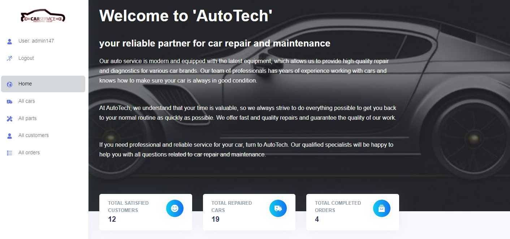

# Car Service

Django project for managing car service 


## Try it
[Car project deployed on Render.com](https://car-service-f92j.onrender.com/)

you can use next credentionals:
```shell
login: user
password: 123use321
```

## Installing / Getting started

Python3 must be already installed

```shell
git clone https://github.com/Ihor-Ivashov/car-service.git
cd car-service
python3 -m venv venv
source venv/bin/activate
pip install -r requirements.txt
python manage.py createsuperuser --username USERNAME
python manage.py runserver
```


## Demo

